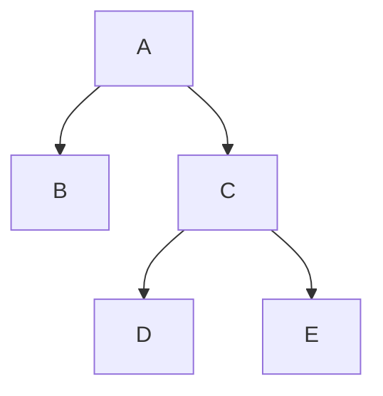

# Description

The Mukurtu Collections module provides a "Collection" content type. A collection contains a sequence of other content in the "Items in Collection" field as well as other metadata fields that represent the collection as a whole. It also provides a custom entity for "Personal Collections", which are user specific collections that can be private to the user or shared publicly.

# Collections
Collections are nodes and have a custom bundle class `Collection`. They are protocol controlled. The protocol settings only impact the collection entity itself, not the items contained within. Each item within the collection should have its individual protocol settings respected.

## Sub-Collections
Mukurtu CMS has a notion of sub-collections, which is a way to organize collections in a hierarchy, primarily for display.
These are controlled by the `field_parent_collection` field which references the single parent collection and `field_child_collections` which references zero to many child (sub) collections.
* Any single collection can only belong to a single collection hierarchy.
* Currently, all collections in a given collection hierarchy can have their own protocol settings, so it is important to remember that how a collection looks could vary greatly by a user's memberships.
  * This means some operations involving a collection hierarchy can be "expensive" for large hierarchies (e.g., getCount, displaying the organization controls)
  * Each node of the hierarchy tree is the source of the next leaf nodes (sub-collections), so when displaying a collection hierarchy, descent into sub-collections will stop for that branch if the user does not have access to the current node. For example if the following are all collections, but a user does not have access to collection `C`, they will not be shown `D` or `E`. Given a normal SAPI configuration, they will be able to find `D` and `E` individually on the collections browse page.

# Personal Collections
Personal collections have a custom entity type `personal_collection`. They are not protocol controlled, they have their own set of access logic controlled by `PersonalCollectionAccessControlHandler`. Mostly this is the standard Drupal permissions with some additional logic for the "Privacy Setting" field, which scopes the level of view access to either the owner (`private`) or everybody (`public`).

# Computed Fields

## Node - Collections (field_in_collection)
This computed field, controlled by `MukurtuInCollectionFieldItemsList`, contains a list of the collections (not including personal collections) that the content is found in.
